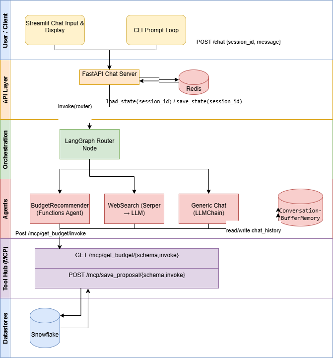

uvicorn mcp_tools:app --port 9000 ← MCP tool hub
uvicorn serve:app --port 8000 ← chat service

# Campaign Performance Optimization Platform

[](https://www.python.org/)  
[](https://fastapi.tiangolo.com/)  
[](https://streamlit.io/)  
[](LICENSE)

A multi-agent system for analyzing and reallocating marketing budgets via chat.  
Leverages LangGraph for orchestration, LangChain + OpenAI for LLM routing & function-calling, and a standalone MCP tool hub for database integration.

---

## 🚀 Features

- **Intelligent Routing**  
  Router agent delegates to Budget, Web-Search, or Generic sub-agents via keywords & GPT-4O prompts.

- **Budget Recommender Agent**  
  - Fetches daily channel metrics from Snowflake  
  - Proposes new budget splits within ±5% of current spend  
  - Persists approved proposals back to the database  

- **Modular MCP Tool Hub**  
  - FastAPI service auto-discovering Pydantic-typed tools at `/mcp/{tool}/{schema,invoke}`  
  - Stateless, load-balanced microservice for tool integrations  

- **Stateful Sessions**  
  - Per-user context stored in Redis (30-minute TTL)  
  - Supports simultaneous, separate conversations  

- **Asynchronous I/O**  
  - Async FastAPI endpoints & HTTPX Async clients  
  - Database calls offloaded to thread-pool or async connector  

- **Web-Search & Generic Chat**  
  - Google Serper integration for marketing-focused summaries  
  - Fallback generic assistant for greetings and off-topic queries  

---

## 📦 Getting Started

### 1. Clone the repo  
```bash
git clone https://github.com/your-org/campaign-optimization.git
cd campaign-optimization
```

### 2. Set up environment  
- Copy `.env.example` → `.env` and fill in your keys:
  ```ini
  OPENAI_API_KEY=…
  SNOWFLAKE_USER=…
  SNOWFLAKE_PASSWORD=…
  SNOWFLAKE_ACCOUNT=…
  SNOWFLAKE_DATABASE=…
  SNOWFLAKE_SCHEMA=…
  SNOWFLAKE_WAREHOUSE=…
  REDIS_URL=redis://localhost:6379
  SERPER_API_KEY=…
  ```

### 3. Install dependencies  
```bash
python3 -m venv .venv
source .venv/bin/activate
pip install -r requirements.txt
```

### 4. Launch services  
```bash
# 1) MCP Tool Hub on port 9000
uvicorn mcp_tools:app --port 9000

# 2) Chat API server on port 8000
python server.py

# 3) Streamlit UI on port 8501
streamlit run app.py
```

---

## 🔧 Architecture



1. **Client** (CLI/Streamlit) → `POST /chat`  
2. **FastAPI Server** → load session state from Redis  
3. **Router Agent** (LangGraph) → select branch  
4. **Sub-Agent** → calls MCP tool endpoints for data & actions  
5. **MCP Tool Hub** → synchronous/async DB operations  
6. **State updated** in Redis → reply returned to client  

---

## 📁 Repo Structure

```
.
├── agents/                # LangGraph router & sub-agents
├── tools/                 # Pydantic‐typed MCP tool modules
├── mcp_tools.py           # FastAPI MCP hub auto-discovery
├── orchestrator.py        # LangGraph graph definition
├── server.py              # FastAPI chat API (Redis-backed)
├── app.py                 # Streamlit UI
├── requirements.txt
└── docs/
    └── flowdiagram.drawio.png
```

---

## 🛠️ Future Enhancements

- **Vector Embeddings** for caching & semantic search  
- **Reinforcement-Learning Loop** for autonomous budget tuning  
- **Additional Tools** (weather, CRM, file processors, etc.)  
- **Multi-Modal Support** (image‐based creative analysis)  

---

## 🤝 Contributing

1. Fork the repo  
2. Create a feature branch  
3. Add tests & update docs  
4. Open a pull request  

---

## 📜 License

This project is licensed under the **MIT License**. See [LICENSE](LICENSE) for details.
